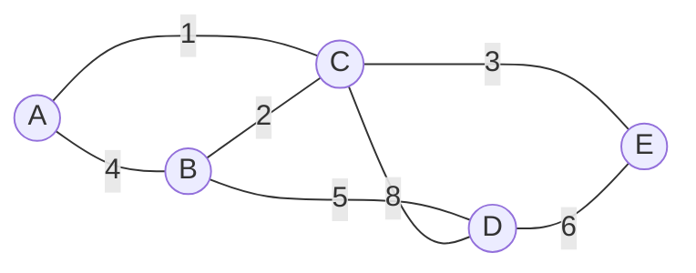
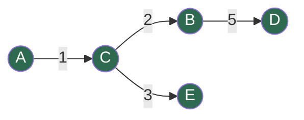

# 🌳 Spanning Trees & Minimum Spanning Trees (MST)

> A first-principles guide to spanning trees, MSTs, and the two properties every MST algorithm is built on.

---

## 📖 Table of Contents
- [What is a Spanning Tree?](#what-is-a-spanning-tree)
- [The Golden Rule](#the-golden-mathematical-rule-of-trees)
- [What is an MST?](#what-is-a-minimum-spanning-tree-mst)
- [The Uniqueness Rule](#the-uniqueness-rule)
- [The Two Principles of MSTs](#the-two-principles-of-msts)
- [Visual Example](#visual-example)
- [Quick Reference](#quick-reference)

---

## What is a Spanning Tree?

A graph's spanning tree is an **acyclic connected subgraph** of the given graph that includes **all** of the graph's vertices.

<strong>🔍 Click to break down each term</strong>

| Term | Meaning |
|---|---|
| **Subgraph** | Formed entirely from the existing edges and vertices of the original graph. You can't invent new edges. |
| **Spanning** | It must "span" the entire graph — every single vertex is included. |
| **Connected** | A valid path exists between any two vertices in the tree. No vertex is isolated. |
| **Acyclic** | No cycles, no redundant loops, no alternative routes. Exactly **one unique path** exists between any two vertices. |

---

## The Golden Mathematical Rule of Trees

> If a graph has **n** vertices, a spanning tree will **always** have exactly **n − 1** edges.

- ❌ Fewer than `n - 1` edges → the graph **cannot** be connected.
- ❌ More than `n - 1` edges → the graph **must** contain a cycle.

---

## What is a Minimum Spanning Tree (MST)?

Add **weights** (cost, distance, time) to the edges. The weight of a tree = sum of the weights of its edges.

> The **MST** of a connected, undirected, weighted graph **G** is the spanning tree of **G** whose total edge weight is the smallest possible.

### The Uniqueness Rule

| Condition | Result |
|---|---|
| All edge weights are **distinct** | Exactly **one** unique MST |
| Some edge weights are **identical** | **Multiple** valid MSTs, all sharing the same minimum total cost |

---

## The Two Principles of MSTs

Every MST algorithm ever invented (Kruskal's, Prim's, Borůvka's...) is just an application of one of these two rules.

<strong>✂️ The Cut Property — how to <em>build</em> an MST</strong>

Split all vertices into two groups, **A** and **B**. Look at every edge crossing that divide.

> **The lightest edge crossing the cut must be part of the MST.**

**Why?** To connect the whole graph you must cross that divide at least once. If you picked a more expensive crossing edge, you could always swap it for the cheaper one and get a better total weight.

<strong>🔁 The Cycle Property — how to <em>fix</em> a broken MST</strong>

Find a cycle (a loop) in the graph.

> **The heaviest edge in that cycle cannot be part of the MST.**

**Why?** A cycle means redundancy — you can remove exactly one edge from it and every vertex stays connected. To minimize total weight, remove the most expensive edge in the loop.

---

## Visual Example

**MST edges (lowest-cost path connecting all vertices):**

---

## Quick Reference

| Concept | Rule |
|---|---|
| Edges in spanning tree | `n - 1` |
| Too few edges | Graph disconnected |
| Too many edges | Graph has a cycle |
| Cut Property | Lightest edge crossing a cut ∈ MST |
| Cycle Property | Heaviest edge in a cycle ∉ MST |
| Unique MST | Only when all weights are distinct |

---

### 📚 Related Topics
- [ ] Kruskal's Algorithm (Cycle Property application)
- [ ] Prim's Algorithm (Cut Property application)
- [ ] Union-Find (Disjoint Set) data structure
- [ ] Borůvka's Algorithm

---

  
  

