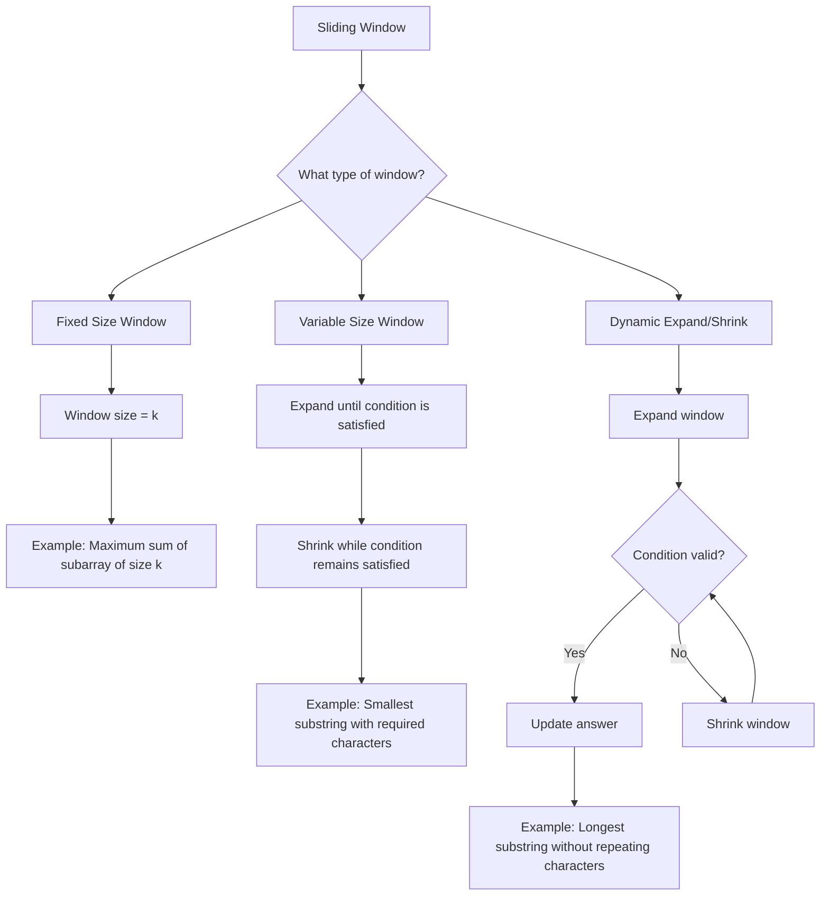

# Sliding Window – Complete Patterns

The **Sliding Window** technique is a powerful method used to reduce the time complexity of problems involving subarrays, substrings, or contiguous sections of data.

It works by maintaining a **window** (continuous range) over the input, moving it step-by-step while keeping track of relevant information to answer the problem efficiently.

---

## Core Idea

Instead of recalculating values for each possible subarray/subsequence from scratch (**O(n²)**), we:
- Keep a **window** that represents the current range.
- Move **left** or **right** pointers to expand or shrink the window.
- Update the result dynamically as the window changes.

---
## Sliding Window Flowchart


---

## Types of Sliding Window Problems

### 1. Fixed-Size Sliding Window
Useful when the window length `k` is given and constant.

#### Idea and Approach
- Start with the first `k` elements.
- Slide the window one step at a time.
- Remove the leftmost element and add the new rightmost element.

#### Algorithm
1. Compute sum/aggregate for first `k` elements.
2. For each next index:
   - Subtract outgoing element.
   - Add incoming element.
3. Update result.

#### C++ Example
```cpp
int maxSumSubarray(vector<int>& nums, int k) {
    int sum = 0, maxSum = 0;
    for (int i = 0; i < k; i++) sum += nums[i];
    maxSum = sum;
    for (int i = k; i < nums.size(); i++) {
        sum += nums[i] - nums[i - k];
        maxSum = max(maxSum, sum);
    }
    return maxSum;
}
```
#### Important Problems
[209. Minimum Size Subarray Sum](https://leetcode.com/problems/minimum-size-subarray-sum/)

[643. Maximum Average Subarray I](https://leetcode.com/problems/maximum-average-subarray-i/)

[1423. Maximum Points You Can Obtain from Cards](https://leetcode.com/problems/maximum-points-you-can-obtain-from-cards/)

[2461. Maximum Sum of Distinct Subarrays With Length K](https://leetcode.com/problems/maximum-sum-of-distinct-subarrays-with-length-k/)

---
### 2. Variable-Size Sliding Window (Longest/Shortest Subarray)

A variable-size sliding window changes size dynamically until it meets some constraint.
It’s commonly used for longest/shortest substring problems.

#### Idea and Approach
- Expand the window by moving the right pointer.

- Shrink the window from the left when a constraint is violated.

- Track the best length/value found.

#### Algorithm
1. Start with both left and right at 0.

2. Move right forward and include new elements in the window.

3. While the constraint is violated: move left forward to shrink the window.

4. Update the best answer whenever the window is valid.

#### C++ Example:
```cpp
int lengthOfLongestSubstring(string s) {
    unordered_set<char> st;
    int left = 0, ans = 0;
    for (int right = 0; right < s.size(); right++) {
        while (st.count(s[right])) {
            st.erase(s[left++]);
        }
        st.insert(s[right]);
        ans = max(ans, right - left + 1);
    }
    return ans;
}
```

#### Important Problems

[3. Longest Substring Without Repeating Characters](https://leetcode.com/problems/longest-substring-without-repeating-characters/)

[209. Minimum Size Subarray Sum](https://leetcode.com/problems/minimum-size-subarray-sum/)

[1004. Max Consecutive Ones III](https://leetcode.com/problems/max-consecutive-ones-iii/)

---

### 3. Sliding Window with Frequency Map / Counting

Sometimes we need to track counts of characters/numbers in the window for constraints.
This is especially useful for problems like Minimum Window Substring or subarrays with exactly k distinct elements.

#### Idea and Approach
- Use a hashmap (or array if limited range) to track counts of each element.

- Expand window until all required conditions are met.

- Shrink from left while maintaining validity.

#### Algorithm (Minimum Window Substring)
1. Count frequency of required characters.

2. Expand right pointer until all characters are covered.

3. Shrink left pointer to find smaller valid windows.

4. Keep track of the smallest valid window.

#### C++ Example: Minimum Window Substring
```cpp
string minWindow(string s, string t) {
    unordered_map<char,int> need, have;
    for (char c : t) need[c]++;
    int required = need.size(), formed = 0;
    int l = 0, r = 0, start = 0, len = INT_MAX;

    while (r < s.size()) {
        have[s[r]]++;
        if (have[s[r]] == need[s[r]]) formed++;
        
        while (l <= r && formed == required) {
            if (r - l + 1 < len) start = l, len = r - l + 1;
            have[s[l]]--;
            if (have[s[l]] < need[s[l]]) formed--;
            l++;
        }
        r++;
    }
    return len == INT_MAX ? "" : s.substr(start, len);
}
```

#### Important Problems

[76. Minimum Window Substring](https://leetcode.com/problems/minimum-window-substring/)

[992. Subarrays with K Different Integers](https://leetcode.com/problems/subarrays-with-k-different-integers/)

[1358. Number of Substrings Containing All Three Characters](https://leetcode.com/problems/number-of-substrings-containing-all-three-characters/)


---
### 4. Exactly K (Convert to AtMost)

Some problems ask for exactly k occurrences of something (e.g., exactly k odd numbers, exactly k distinct characters, etc.).
Directly counting "exactly k" is hard, but we can use this key trick:
`exactly(k) = atMost(k) − atMost(k-1)`

#### Idea and Approach

- Define atMost(k) = number of subarrays with at most k occurrences of the property (e.g., odds, distinct chars).

- Then:

    - atMost(k) counts all subarrays with 0,1,2,…,k occurrences.

    - atMost(k-1) counts all subarrays with 0,1,2,…,(k-1) occurrences.

- Subtracting gives the count of subarrays with exactly k.

#### C++ Example (Count Subarrays with Exactly K Odd Numbers)
```cpp
class Solution {
public:
    int atMost(vector<int>& nums, int k) {
        int left = 0, count = 0, oddCount = 0;
        for (int right = 0; right < nums.size(); right++) {
            oddCount += nums[right] % 2;     
            while (oddCount > k) {
                oddCount -= nums[left++] % 2;
            }
            count += right - left + 1;       
        }
        return count;
    }

    int numberOfSubarrays(vector<int>& nums, int k) {
        return atMost(nums, k) - atMost(nums, k - 1);
    }
};
```
---
#### Important Problems
[992. Subarrays with K Different Integers](https://leetcode.com/problems/subarrays-with-k-different-integers/)

[1248. Count Number of Nice Subarrays](https://leetcode.com/problems/count-number-of-nice-subarrays/)

[930. Binary Subarrays With Sum](https://leetcode.com/problems/binary-subarrays-with-sum/)

---

### 5. Product / Sum Constraints (Multiplicative)

For problems like Subarray Product Less Than K, instead of sum constraints,
we maintain a product and shrink window when the product exceeds the limit.

#### Idea and Approach
- Keep a running product of the current window.

- Expand the right pointer while product ≤ k.

- Shrink from left until product ≤ k.

#### C++ Example: Subarray Product Less Than K
```cpp
int numSubarrayProductLessThanK(vector<int>& nums, int k) {
    if (k <= 1) return 0;
    int prod = 1, left = 0, count = 0;
    for (int right = 0; right < nums.size(); right++) {
        prod *= nums[right];
        while (prod >= k) prod /= nums[left++];
        count += right - left + 1;
    }
    return count;
}
```

#### Important Problems

[713. Subarray Product Less Than K](https://leetcode.com/problems/subarray-product-less-than-k/)

[930. Binary Subarrays With Sum](https://leetcode.com/problems/binary-subarrays-with-sum/)

---

## When to Use Sliding Window

### 1. Contiguous Subarrays/Substrings

If the problem says:

- “subarray” (not subsequence),

- “substring” (not subsequence),

- dealing with windowed conditions like sum, length, count...

Think sliding window.

### 2. You Need to Find a Window That Satisfies a Condition

For example:

- Smallest or longest subarray where sum ≥ target

- Longest substring with at most k distinct characters

- Maximum sum of subarray of size k

- Count of subarrays with a fixed sum

### 3. All Elements Are Positive (or Have Special Structure)

Many sliding window problems (like minSubArrayLen) assume:

- No negatives → sum can only increase → easy to shrink window

- This helps with shrinking logic (while (sum >= target))

---
