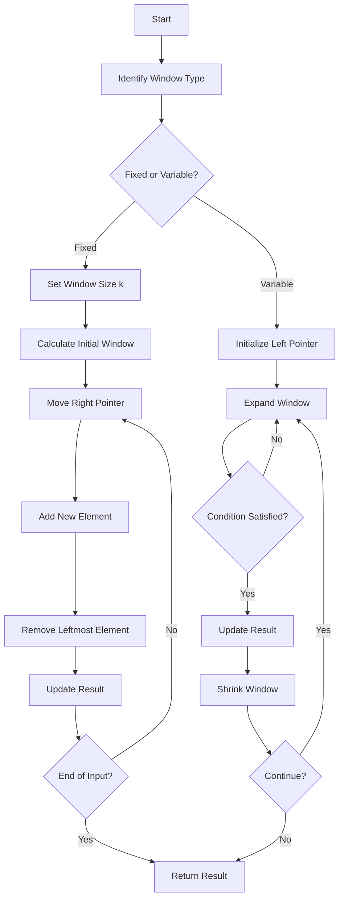

## Sliding Window Algorithm

The **Sliding Window Algorithm** is an efficient technique used to solve problems involving **arrays, lists, and strings** by maintaining a window over a portion of the data and moving it through the input.

It is mainly used for **subarray and substring problems**.

## Where Is Sliding Window Used?

- **Arrays/Lists:** Maximum sum of a subarray of size `k`
- **Strings:** Longest substring without repeating characters
- **Variable Window:** Smallest subarray or substring satisfying a condition

## Sliding Window Algorithm


---

## Let’s solve few problems using Sliding Window Algorithm

## Problem Statement

Given an array of integers and a fixed window size `k`, find the **maximum sum of any contiguous subarray of size `k`**.

---

```cpp
package slidingwindowalgorithm;

public class MaxSumSubArray {

    public static void main(String[] args) {

        int[] arr = {2, 1, 5, 0, 1, 2, 3, 0, 2, 1};
        int k = 3;

        int maxSum = findMaxSumSubArray(k, arr);

        System.out.println("Maximum Sum: " + maxSum);
    }

    private static int findMaxSumSubArray(int k, int[] arr) {

        // Sum of the current window
        int windowSum = 0;

        // Calculate sum of the first window
        for (int i = 0; i < k; i++) {
            windowSum += arr[i];
        }

        // First window is initially the maximum
        int maxSum = windowSum;

        // Slide the window
        for (int i = k; i < arr.length; i++) {

            // Remove the element leaving the window
            // and add the new element
            windowSum += arr[i] - arr[i - k];

            // Update maximum sum
            maxSum = Math.max(maxSum, windowSum);
        }

        return maxSum;
    }
}

```

## Complete Dry Run

| Step | Current Window | Calculation | Window Sum | Max Sum |
|------|----------------|-------------|------------|---------|
| 1 | `[2,1,5]` | `2+1+5` | 8 | 8 |
| 2 | `[1,5,0]` | `8-2+0` | 6 | 8 |
| 3 | `[5,0,1]` | `6-1+1` | 6 | 8 |
| 4 | `[0,1,2]` | `6-5+2` | 3 | 8 |
| 5 | `[1,2,3]` | `3-0+3` | 6 | 8 |
| 6 | `[2,3,0]` | `6-1+0` | 5 | 8 |
| 7 | `[3,0,2]` | `5-2+2` | 5 | 8 |
| 8 | `[0,2,1]` | `5-3+1` | 3 | 8 |


---

## Problem: Calculates the length of the longest substring without repeating characters in a string.

---

```cpp
package slidingwindowalgorithm;

import java.util.HashMap;
import java.util.Map;

public class LongestSubstringWithoutRepeatingCharacters {
    public static void main(String[] args) {
        String str = "abcbbcbbkhlkkmnhhgbabfds";
        int longestSubstringLength = findLongestSubstringWithoutRepeatingCharacters(str);
        System.out.println(longestSubstringLength);
    }

    private static int findLongestSubstringWithoutRepeatingCharacters(String str) {
        // map to store the characters in the string and their last occurrence index
        Map<Character, Integer> charMap = new HashMap<>();
        int pointer = 0;
        int maxLength = 0;
        for (int i = 0; i < str.length(); i++) {
            char currentChar = str.charAt(i);
            // if character is already present in the map, move the pointer to the next index of the last occurrence of the character
            if (charMap.containsKey(currentChar)) {
                pointer = Math.max(pointer, charMap.get(currentChar) + 1);
            }
            // for each character, store the index of its last occurrence
            charMap.put(currentChar, i);
            // calculate the length of the current substring
            maxLength = Math.max(maxLength, i - pointer + 1);
        }
        return maxLength;
    }
}
```
---
## Complete Dry Run

| Index | Char | Previous Index | Pointer | Current Window | Length | Max Length |
|------:|:----:|---------------:|--------:|----------------|-------:|-----------:|
| 0 | `a` | `-` | 0 | `a` | 1 | 1 |
| 1 | `b` | `-` | 0 | `ab` | 2 | 2 |
| 2 | `c` | `-` | 0 | `abc` | 3 | 3 |
| 3 | `b` | 1 | 2 | `cb` | 2 | 3 |
| 4 | `b` | 3 | 4 | `b` | 1 | 3 |
| 5 | `c` | 2 | 4 | `bc` | 2 | 3 |
| 6 | `b` | 4 | 5 | `cb` | 2 | 3 |
| 7 | `b` | 6 | 7 | `b` | 1 | 3 |
| 8 | `k` | `-` | 7 | `bk` | 2 | 3 |
| 9 | `h` | `-` | 7 | `bkh` | 3 | 3 |
| 10 | `l` | `-` | 7 | `bkhl` | 4 | 4 |
| 11 | `k` | 8 | 9 | `hlk` | 3 | 4 |
| 12 | `k` | 11 | 12 | `k` | 1 | 4 |
| 13 | `m` | `-` | 12 | `km` | 2 | 4 |
| 14 | `n` | `-` | 12 | `kmn` | 3 | 4 |
| 15 | `h` | 9 | 12 | `kmnh` | 4 | 4 |
| 16 | `h` | 15 | 16 | `h` | 1 | 4 |
| 17 | `g` | `-` | 16 | `hg` | 2 | 4 |
| 18 | `b` | 7 | 16 | `hgb` | 3 | 4 |
| 19 | `a` | 0 | 16 | `hgba` | 4 | 4 |
| 20 | `b` | 18 | 19 | `ab` | 2 | 4 |
| 21 | `f` | `-` | 19 | `abf` | 3 | 4 |
| 22 | `d` | `-` | 19 | `abfd` | 4 | 4 |
| 23 | `s` | `-` | 19 | `abfds` | 5 | 5 |

